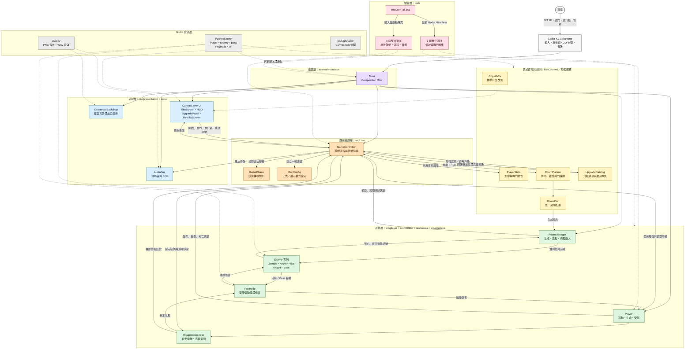
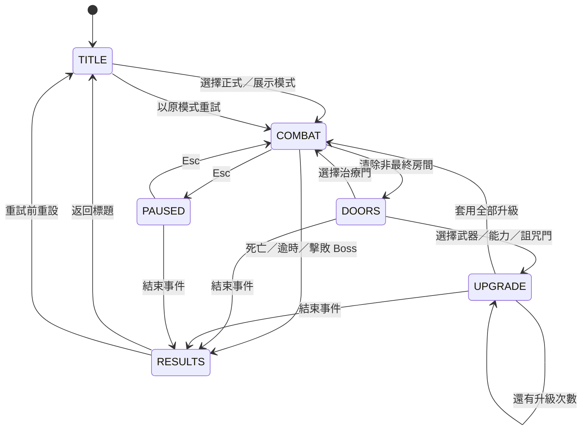

# 《暮墓餘燼》專案架構

本文件依目前程式碼整理，描述 `Ashes at Dusk` 的技術棧、主要模組、執行期資料流與測試邊界。

## 技術棧

| 分類 | 技術 | 專案用途 |
| --- | --- | --- |
| 遊戲引擎 | Godot Engine 4.7.1 | 2D 場景樹、物理、輸入、音效與 UI 執行環境 |
| 程式語言 | GDScript 2.0 | 遊戲流程、戰鬥、敵人 AI、房間規劃與介面邏輯 |
| 場景與資源 | `.tscn`、PNG、WAV | PackedScene 組裝、背景圖與遊戲音效 |
| 視覺效果 | Godot CanvasItem Shader | UI 模糊與遮罩效果 |
| 測試 | Godot Headless、PowerShell | 單元、整合、場景啟動與資源匯入驗證 |
| 版本控制 | Git、GitHub | 原始碼、文件與資源版本管理 |

## 元件架構圖

## 執行期狀態流

`GameController` 是流程的唯一協調者，所有階段切換都必須通過 `GamePhase.can_transition()`。

## 核心資料流

1. `main.tscn` 建立所有長生命週期節點，並把節點引用注入 `GameController`。
2. UI 只送出操作訊號；`GameController` 驗證目前階段後決定房間、升級、暫停或結算流程。
3. `RoomPlanner` 依 `RunConfig`、房間序號與詛咒狀態產生 `RoomPlan`，再由 `RoomManager` 實例化敵人與 Boss。
4. `PlayerStats` 是玩家與武器共用的執行期屬性來源；`UpgradeCatalog` 回傳更新後的屬性與武器等級，由控制器同步套用。
5. 戰鬥結果透過 Godot signal 回到控制器，控制器再更新 HUD、音效、吸血、房間進度與結算畫面。
6. `tests/run_all.ps1` 以 Godot Headless 執行單元與整合測試，並先做專案匯入／解析檢查。
